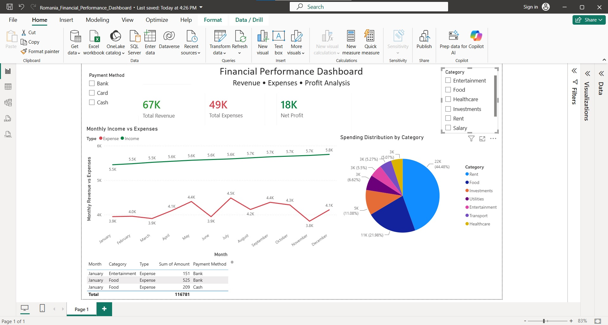
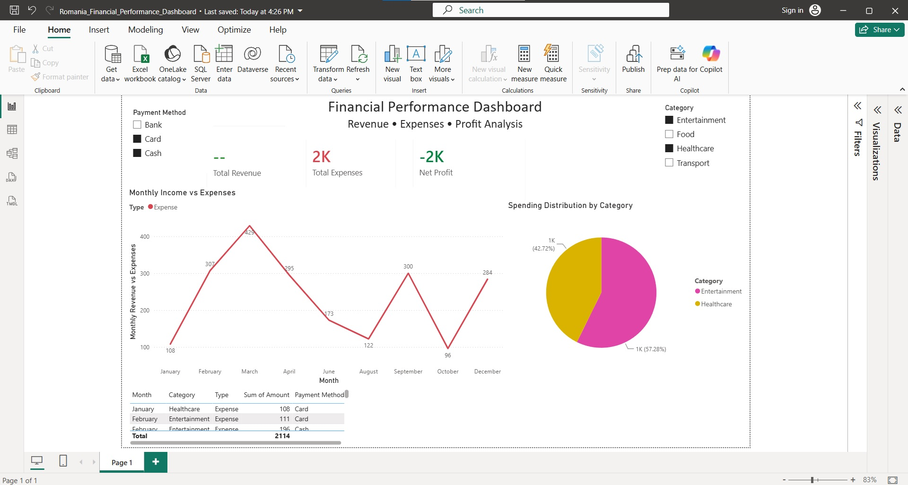
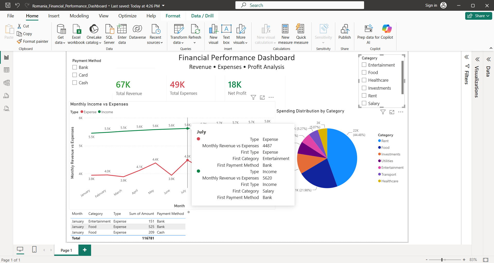

# Financial Performance Dashboard – Power BI

## Project Overview

This project presents an interactive financial performance dashboard built in Power BI using personal finance data for a Romanian household in 2025.

The dashboard provides insights into income, expenses, profitability, and spending patterns through interactive visualizations and filters.

## Dashboard Features

- KPI Cards
  - Total Revenue
  - Total Expenses
  - Net Profit

- Monthly Income vs Expenses Trend Analysis

- Expense Distribution by Category

- Interactive Filters
  - Payment Method
  - Category

- Detailed Transaction Table

## Tools & Technologies

- Power BI Desktop
- Power Query
- DAX
- Microsoft Excel

## Key Insights

- Track monthly income and expense trends
- Identify the largest spending categories
- Monitor overall profitability
- Analyze spending behavior by payment method

## Files Included

- Romania_Financial_Performance_Dashboard.pbix
- Romania_2025_Financial_Dashboard_Data_Positive.xlsx

## Dashboard Preview

